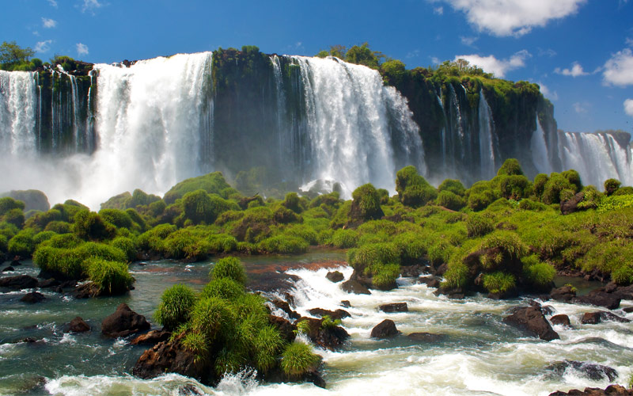
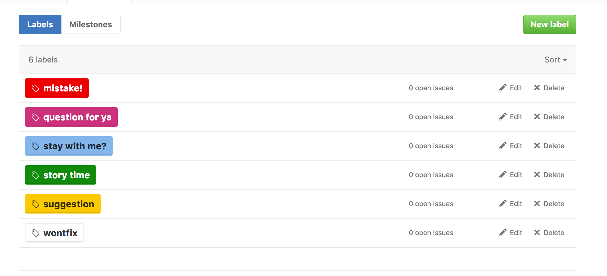
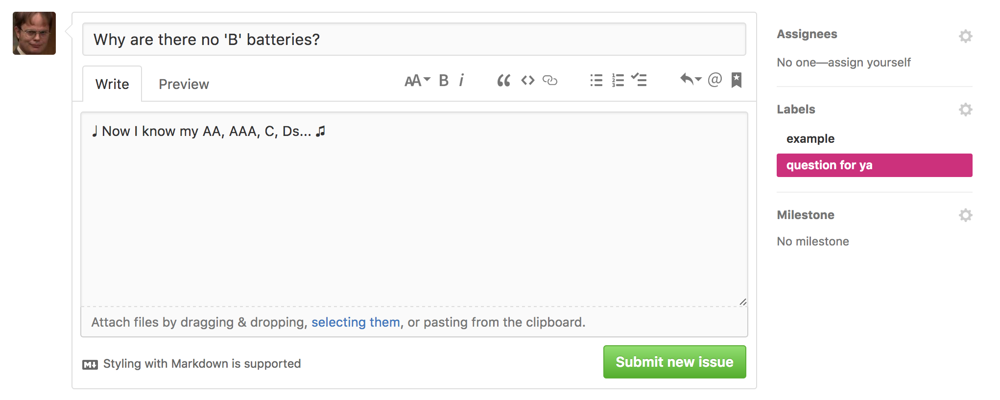

# South America here we come!

Rebecca and Max travel from Cleveland, OH USA to the tip of South America in a car.  We plan to cross the 90 mile Darien Gap by shipping our car, and flying or boating ourselves to Columbia.  From there we will just keep going, zig zagging our way through South America and on toward Patagonia.  We started planning January 1, 2017 and plan to leave around mid July.

## You can help! (and we need you too...)

We are building these pages as we go.  We've got 6 months to plan a 6 monthish trip, and we need all the help we can get. 

**So what can I do?** A lot actually.  Check out the [issues section here](https://github.com/buckmaxwell/rnm-travel-the-world/issues).  Here are some things we'd love for you to post an issue about.

#### mistake!

We all make them, but this one's on us.  Submit an issue for something that is

 + Important to our safety
 	- ie. "A drive through Hogsmeade could be dangerous or impossible as a muggle"
 + Could be a severe setback if unconsidered
 	- ie. "The road to El Dorado will be closed for the season if you arrive after February 15th"
 + Is actually a mistake
 	- ie. "A 1995 Tacoma with a 3.0 liter engine doesn't exist..."

#### question for ya

Have a question for us?  Drop us a line here. This one is super simple.

#### stay with me

Want to put us up for a night, or meet up with us along the way?  **You're awesome!** We'd love to... well, as long as you are not a serial killer... unless you're also a really good cook.

#### suggestion

Where should we eat, hike, camp?  Which of your friends do we need to talk to before we go?  What tools do we need to bring in the back of our car?  What more do we need to do to prepare?

## Pages

This page is the index page, Get further in depth by following the links to other pages.

 - [Picking the Right Vehicle for the Job](car.md)
 - [Spanish Bootcamp (We don't know any... Rebecca put together this schedule so we can learn)](spanish-bootcamp.md)

## Useful links

### Helpful sites along the way

[Free Campsites by City](https://freecampsites.net/#!Columbus,+OH,+United+States)

### Darien Gap Crossing

[Crossing the Darien Gap](http://www.drivetheamericas.com/wiki/vehicle-shipping-across-darien-gap)

[NYC to Argentina article](http://www.nbcnews.com/id/35876322/ns/travel-active_travel/t/-mile-drive-south-nyc-argentina/#.WHah67YrKYU)

### Blogs

[Trans world travelers blog](http://transworldexpedition.com/)

[Hitchhiker's Blog Texas -> South America](https://hitchtheworld.com/)

[Going Alone, Single Vehicle Safety](https://www.tacomaworld.com/threads/going-alone-single-vehicle-wheeling-safety.454083/)

[Couple drives to SA for a year with their dogs](http://southamericadrive.com/)

[Expedition Portal](http://expeditionportal.com/)

